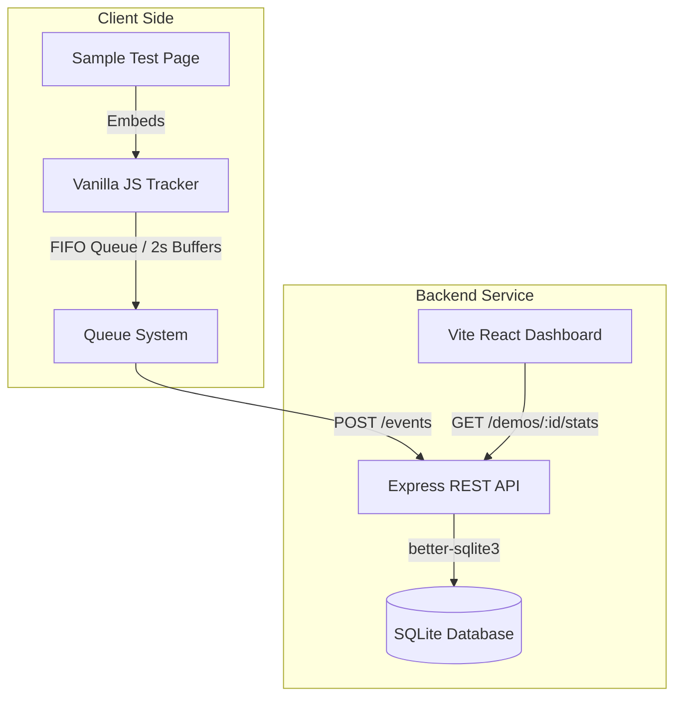

# Shocase Analytics — Full-Stack Demo Video Analytics Platform

A lightweight, robust full-stack video analytics solution built for engineering-focused demo tracking. The platform tracks granular video playback interactions (play, pause, quartile progress, completion) in real time using a self-contained embeddable JavaScript tracker, logs events in a resilient SQLite database, and presents aggregated metrics via a highly polished React dashboard with session-aware analytics and a dynamic insights engine.

---

## 🏗️ Architecture Overview

The system is structured as four decoupled components:



### 1. **Embeddable Tracker (`/tracker`)**
A vanilla, zero-dependency JavaScript snippet that embeds on any host page containing a `<video>` tag.
* **Granular quartile calculations:** Captures `play`, `pause`, `progress_25`, `progress_50`, `progress_75`, and `ended` events.
* **Buffered Event Queue:** Utilizes an in-memory queue array. Instead of immediately dispatching a request on every scroll or playback tick, it buffers events and flushes them sequentially in FIFO order every 2 seconds.
* **Concurrency Locking:** Employs a mutex lock flag (`isFlushing`) to ensure overlapping callbacks never fire duplicate events.
* **Network Resilience:** Uses a catch-and-retry pattern. If a fetch request fails (network timeout or offline state), the event remains in the queue and retries in the next interval, maintaining tracking integrity.

### 2. **Backend API (`/backend`)**
An Express REST service that stores events and aggregates real-time performance logs.
* **SQLite Database (`/backend/db.js`):** Employs `better-sqlite3` for high-throughput, synchronous local SQLite operations. Features automated inline schema migration for seamless database setup.
* **POST `/events`:** Exposes a validated entry point to record logs. Enforces strict parameter presence validation and event type containment checks.
* **GET `/demos/:demoId/stats`:** Computes highly granular progression matrices, session metrics, and dynamic product-style performance insights.

### 3. **Vite React Dashboard (`/dashboard`)**
A highly polished single-page application built on React and Tailwind/CSS to review video metrics.
* **Dynamic Insights Grid:** Synthesizes raw events into qualitative indicators (biggest drop-off point, engagement quality, retention patterns).
* **Polished UX States:** Integrated smooth cubic-bezier loader animations, complete step-by-step guidance cards for mock data generation, and rapid-select demo ID chips.
* **Modern SaaS Visuals:** Visualizes viewer drop-off via custom, CSS-based vertical progress bars with vibrant gradient fills.

---

## 🛠️ Tech Stack & Engineering Decisions

* **Vanilla JavaScript (Tracker):** Ensures that the embedded tracker has a zero-kilobyte bundle overhead, ensuring host page load performance is completely unaffected.
* **Express & SQLite:** Selected to fulfill a "zero-setup, zero-dependency" developer onboarding experience while maintaining ACID compliance for local logging.
* **Google Fonts Inter & Custom CSS:** Replaced standard browser typography and styling frameworks with highly tailored custom HSL tokens, active card translations, and focus halos to deliver a premium, SaaS-quality visual experience.

---

## ⚡ How to Run

### Prerequisite
Ensure you have [Node.js](https://nodejs.org/) installed (v18+ recommended).

### 1. Start the Backend API (Terminal 1)
```bash
cd shocase-analytics/backend
npm install
npm run dev
```
The REST API runs on http://localhost:3001.

### 2. Run the Sample Test Page (Terminal 2)
```bash
cd shocase-analytics/sample
npx serve .
```
Open http://localhost:3000 to interact with the demo video and generate tracking events.

### 3. Launch the React Dashboard (Terminal 3)
```bash
cd shocase-analytics/dashboard
npm install
npm run dev
```
Open http://localhost:5173. Type `demo_001` or click a quick-select chip to view live statistics.

---

## 📊 Analytics Calculations & Progression Logic

### 1. **Session-Aware Metrics**
Rather than simply grouping raw logs by `viewerId` (which dilutes returning user activity), the backend generates a unique `sessionId` via `crypto.randomUUID()` on every page load.
* **Total Views:** Equal to the count of unique sessions that registered a `play` event.
* **Unique Viewers:** Count of distinct persistent `viewerId`s logged in local storage.

### 2. **Ordered Quartile Progression Validation**
To prevent false-positive completions (e.g., a viewer skipping directly from 0% to the end of a video), the backend validates quartile progress sequentially:
$$\text{Play} \longrightarrow \text{25\% Progress} \longrightarrow \text{50\% Progress} \longrightarrow \text{75\% Progress} \longrightarrow \text{Ended}$$
A session is only credited for a progress milestone if **all predecessor markers** exist within the session timeline. This guarantees mathematically correct funnel drop-off curves where higher steps never exceed the counts of lower steps.

### 3. **Dynamic Insights Generation**
* **Biggest Drop-off Point:** Evaluates absolute audience loss between adjacent steps (`play ➔ 25%`, `25% ➔ 50%`, `50% ➔ 75%`, `75% ➔ end`) and returns the largest drop interval.
* **Engagement Quality:** Categorized as `High` ($\ge 70\%$), `Medium` ($\ge 40\%$), or `Low` based on the average sequential completion percentage across played sessions.
* **Retention Summary:** Inspects early abandonment ratios to produce actionable summaries (e.g., `"High early abandonment — viewers lose interest in the first 25%"`).

---

## ⚖️ Engineering Tradeoffs

* **SQLite for Event Storage:**
  * *Tradeoff:* SQLite handles concurrent database writes synchronously, which would bottle neck in a production environment with millions of active tracking streams.
  * *Rationale:* Unmatched for zero-setup take-home reviews. Migrations are performed inline in code to eliminate local database startup friction.
* **In-Memory Tracker Buffering:**
  * *Tradeoff:* Events currently buffered in memory could be lost if a viewer closes the browser tab before the 2-second flush interval.
  * *Rationale:* Maximizes client battery and browser thread performance by preventing continuous fetch execution.

---

## 🚀 Production Scaling Strategy

If scaling this system to support millions of concurrent viewers, the following changes would be made:

1. **Ingestion Buffer (Kafka/Redis):** Route tracker logs directly to a Redis stream or Kafka topic instead of an Express server. This decouples peak write loads from database operations.
2. **Database migration to ClickHouse/PostgreSQL:** Switch the storage engine to an analytical column-store database like ClickHouse, which is specifically optimized for sub-millisecond aggregations on billions of event records.
3. **WebSockets/Server-Sent Events (SSE):** Replace HTTP poll fetching in the dashboard with an SSE stream to push real-time viewer drops directly to the client as they happen.
4. **JWT Authentication & Tenant Isolation:** Add token-based authentication to lock down data access, ensuring demo IDs are cryptographically isolated per user/account.

---

## 🤖 AI Tooling & Collaboration Disclosure

This codebase was developed in pair-programming collaboration with **Antigravity (Google DeepMind)**.
* **Scaffolding:** Antigravity assisted in setting up the Express API structure, standardizing the React state controls, and generating the baseline better-sqlite3 database connection.
* **Calculations:** The sequential ordered quartile progression algorithms and dynamic SaaS metric insights engine were jointly conceptualized and debugged through iterative performance reviews.
* **Refinement:** Antigravity assisted in polishing CSS transitions, adding the lightweight FIFO queue system to the vanilla tracker, and ensuring high-fidelity typography across both mobile and desktop screen ratios.
